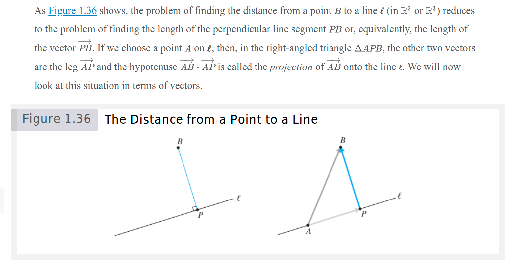
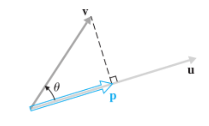
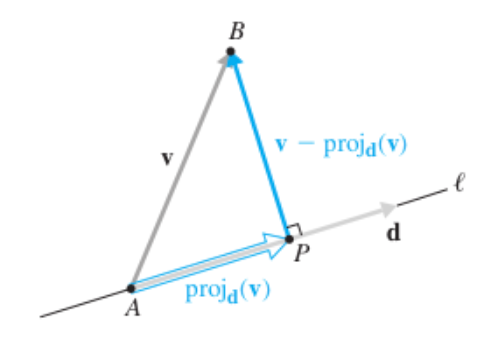

# Distance from a Point to a Line

- In this picture, there is a vector $u$
- We can define any vector that overlaps with $u$ by:
  1. Finding the unit vector of $u$ (i.e. $\frac{u}{||u||}$), which gives the direction of $u$
  2. Multiplying the unit vector by a scalar $p$ to get a vector that overlaps with $u$ (i.e. $t\frac{u}{||u||}$)
  3. That new vector will have length $p$ and will overlap with $u$
- With that in mind, we will define a vector $p$ such that it terminates at the point such that it connects to the head of $v$ and is perpendicular to $u$
- From trigonometry, we know that $cos(\theta) = \frac{adjacent}{hypotenuse} = \frac{||p||}{||v||}$
  - I.e., "the cosine of the angle between $p$ and $v$ is equal to the length of $p$ divided by the length of $v$"
  - Solving for $||p||$, we get $||p|| = ||v||cos(\theta)$
- Since $p = ||p||\frac{u}{||u||}u$, we can substitute $||p||$ to get $p = ||v||cos(\theta)\frac{u}{||u||}u$
  - We know from the section on [angle difference](./distance-and-angles.md#with-angles) that $cos(\theta) = \frac{u \cdot v}{||u|| \cdot ||v||}$
  - Substituting that in, we get $p = ||v|| \frac{u \cdot v}{||u|| \cdot ||v||} \frac{1}{||u||}u$
    - We can cacel out the $||v||$ terms to get $p = \frac{u \cdot v}{||u||} \frac{1}{||u||}u$
    - We know that $||u|| ||u|| = u \cdot u$ (since $u \cdot u = ||u||^2$), so we can substitute that in to get $p = \frac{u \cdot v}{u \cdot u}u$
- Thus, the vector $p$ is given by $p = \frac{u \cdot v}{u \cdot u}u$
- I.e., the distance from a point to a line is given by the projection of the point onto the line, $p = \frac{u \cdot v}{u \cdot u}u$

# Terminology

- The term *projection* comes from the idea of projecting an image onto a wall. Imagine a beam of light ways rays parallel to each other and perpendicular to the $u$ shining down on $v$. The projection of $v$ onto $u$ is just the shadow cast, or projected, by $v$ onto $u$.

# Obtuse Angles

- If the angle between $u$ and $v$ is obtuse, then the projection of $v$ onto $u$ will be negative. This is because the projection is the length of the shadow cast by $v$ onto $u$, and if the angle is obtuse, the shadow will be cast in the opposite direction of $u$.
  - I.e., $\text{proj}_u v will be a *negative* scalar times u$

# When $u$ is a Unit Vector

- If $u$ is a unit vector, then the projection of $v$ onto $u$ is just the scalar projection of $v$ onto $u$.
  - I.e., $\text{proj}_u v = (u \cdot v)u$

# Finding Distance from a Point to a Line

> **$d(B, l) = d(v,\text{proj}_d v)$**
>
> When the line is given by a point $A$ and a direction vector $d$, and the point is given by $B$, the distance from $B$ to the line is the distance from $v$ to the projection of $v$ onto $d$.
>
> When the line $l$ is in $R^2$ and given by the equation $ax + by + c = 0$, the distance from the point $B = (x_0, y_0)$ to the line is given by:
>
> **$d(B, l) = \frac{|ax_0 + by_0 + c|}{\sqrt{a^2 + b^2}}$**

- If given a point $B = (1, 0, 2)$ and asked to find the distance to the line $l$ through the point $A = (3, 1, 1)$ with direction vector $d = [-1, 1, 0]$
- 
- We need to calculate the length of $\overrightarrow{PB}$, where $P$ is the point on line $l$ that is closest to $B$
- If we label $v = \overrightarrow{AB}$, 
  - then $\overrightarrow{AP} = \text{proj}_d v$
  - and $\overrightarrow{PB} = v - \text{proj}_d v$
- $v = \overrightarrow{AB} = [1 - 3, 0 - 1, 2 - 1] = [-2, -1, 1]$
- $\text{proj}_d v = \frac{d \cdot v}{d \cdot d}d = \frac{[-1, 1, 0] \cdot [-2, -1, 1]}{[-1, 1, 0] \cdot [-1, 1, 0]}[-1, 1, 0] = \frac{2 + -1 + 0}{1 + 1 + 0}[-1, 1, 0] = \frac{1}{2}[-1, 1, 0] = [-\frac{1}{2}, \frac{1}{2}, 0]$
- $\overrightarrow{PB} = v - \text{proj}_d v = [-2, -1, 1] - [-\frac{1}{2}, \frac{1}{2}, 0] = [-\frac{3}{2}, -\frac{3}{2}, 1]$
- The distance from $B$ to $l$ is the distance of this vector result, which can be calculated by taking the square root of the sum of the squares of the components of the vector
  - I.e., $||\overrightarrow{PB}|| = \sqrt{(-\frac{3}{2})^2 + (-\frac{3}{2})^2 + 1^2} = \sqrt{\frac{9}{4} + \frac{9}{4} + 1} = \sqrt{\frac{9}{4} + \frac{9}{4} + \frac{4}{4}} = \sqrt{\frac{22}{4}} = \sqrt{\frac{11}{2}} = \frac{\sqrt{11}}{\sqrt{2}}$

# Examples

