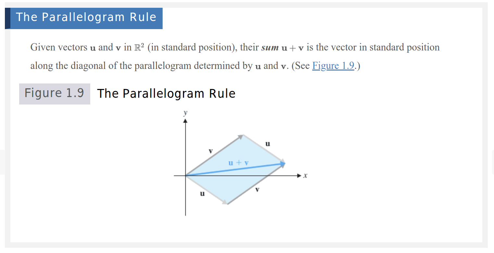
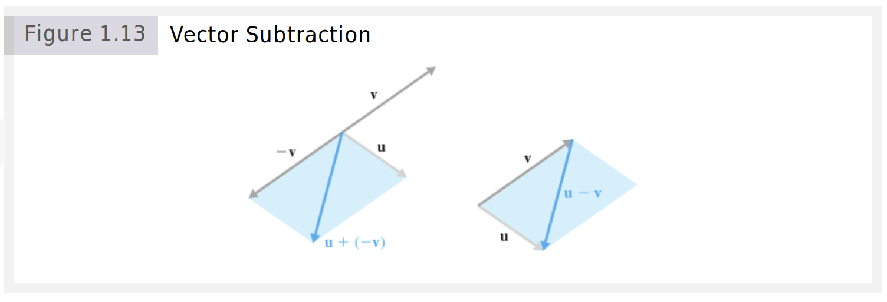
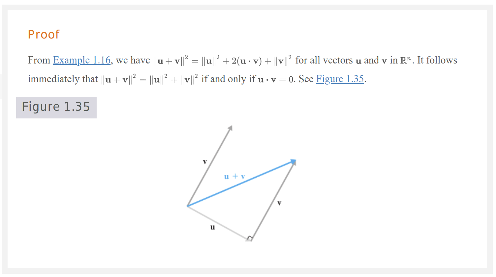

# Terminology

## Definitions

- ***Vectors***: quantities that have both magnitude and direction. The word *vector* comes from the Latin word *vehere*, which means *to carry*. A vector is formed when a point is displaced -- or carried -- a given distance in a given direction.
- The word component is derived from the Latin words co, meaning “together with,” and ponere, meaning “to put.” Thus, a vector is “put together” out of its components.
- A vector is a directed line segment that corresponds to a displacement from one point $A$ to another point $B$. 
- The Point $A$ is called the *initial point* and the point $B$ is called the *terminal point*.
- ***Standard Position***: A vector is in standard position if its initial point is at the origin.
- When vectors are referred to by their coordinates, they are being considered *analytically*.
- Observe that the result of each addition and multiplication belongs to the set ${0, 1, 2}$ ; we say that $Z_3$ is ***closed*** with respect to the operations of addition and multiplication

## Notation

- The vector is denoted by $\overrightarrow{AB}$ or $\overrightarrow{v}$. 
- We can write a vector from point $A$ to point $B$ as [3, 2], where the first component is the $x$-component and the second component is the $y$-component.
- It is a matter of preference whether to write vectors as row vectors or column vectors.
- The set of all vectors in $R^2$ is denoted by $R^2$ and the set of all vectors in $R^3$ is denoted by $R^3$.

# Zero Vector

- The zero vector is the vector that has no magnitude and no direction. It is denoted by $\overrightarrow{0}$

# Operators

## Equality

- Two vectors are equal if they have the same magnitude and direction.
- Every vector can be redrawn so that it is in standard position. This is called the *equivalent vector*.

## Addition

- The sum of two vectors $\overrightarrow{v}$ and $\overrightarrow{w}$ is the vector that results from placing the initial point of $\overrightarrow{w}$ at the terminal point of $\overrightarrow{v}$.
- $u + v = [u_1 + v_1, u_2 + v_2]$
- **The Parallelogram Law**: The sum of two vectors is the diagonal of the parallelogram formed by the two vectors.
  - 

## Subtraction

- The difference of two vectors $\overrightarrow{v}$ and $\overrightarrow{w}$ is the vector that results from placing the initial point of $\overrightarrow{w}$ at the terminal point of $\overrightarrow{v}$ and then reversing the direction of $\overrightarrow{w}$.
- $u - v$ corresponds to the "other" diagonal of the parallelogram formed by $u$ and $v$.
  - 

## Scalar Multiplication

- The product of a scalar $c$ and a vector $\overrightarrow{v}$ is the vector that results from multiplying each component of $\overrightarrow{v}$ by $c$, or the magnitude of $\overrightarrow{v}$ by $c$.
  - $cv$ is a "scaled" version of $v$. 
- $cv$ has the same direction as $v$ if $c > 0$ and the opposite direction if $c < 0$.
- $cv$ is $|c|$ times as long as $v$.
- Two vectors are **scalar multiples** of each other if and only if they are parallel.

## Dot Product

- The dot product of two vectors $\overrightarrow{v}$ and $\overrightarrow{w}$ is the scalar that results from multiplying the corresponding components of $\overrightarrow{v}$ and $\overrightarrow{w}$ and then adding the products.
- The dot product of two vectors is a scalar.
- I.e., $u \cdot v$ is the sum of the products of the corresponding components of $u$ and $v$.
- the dot product $u \cdot v$ is a number, not another vector. (This is why $u \cdot v$ is sometimes called the **scalar product** of $u$ and $v$.) The dot product of vectors in $R^n$ is a special and important case of the more general notion of **inner product**

## Dot Product Properties

- **Commutativity**: $u \cdot v = v \cdot u$
- **Distributive Property**: $u \cdot (v + w) = u \cdot v + u \cdot w$
- **Distributive Property**: $(c + d)u \cdot v = cu \cdot v + du \cdot v$
- $u \cdot u \geq 0$ and $u \cdot u = 0$ if and only if $u = 0$.
- $(cu) \cdot v = c(u \cdot v)$

# Properties

- **Commutativity**: $\overrightarrow{v} + \overrightarrow{w} = \overrightarrow{w} + \overrightarrow{v}$.
- **Associativity**: $(\overrightarrow{u} + \overrightarrow{v}) + \overrightarrow{w} = \overrightarrow{u} + (\overrightarrow{v} + \overrightarrow{w})$.
- **Distributive Property**: $c(\overrightarrow{v} + \overrightarrow{w}) = c\overrightarrow{v} + c\overrightarrow{w}$.
- **Distributive Property**: $(c + d)\overrightarrow{v} = c\overrightarrow{v} + d\overrightarrow{v}$.
- $u + 0 = u$ for all vectors $u$.
- $u + (-u) = 0$ for all vectors $u$.
- $1u = u$ for all vectors $u$.
- $c(du) = (cd)u$ for all vectors $u$ and all scalars $c$ and $d$.

# Vectors in $R^3$

- Points and vectors are located using three mutually perpendicular coordinate axes that meet at the origin $O$. A point such as $A=(1,2,3)$ can be located as follows: 
  1. First travel $1$ unit along the $x$-axis
  2. Then move $2$ units parallel to the $y$-axis
  3. Move $3$ units parallel to the $z$-axis.
  - The corresponding vector $a = [1, 2, 3]$ is then $\overrightarrow{OA}$

# Vectors in $R^n$

- $v = [v_1, v_2, \ldots, v_n]$
  - The individual entries of $v$ are called the *components* of $v$ and $v_i$ is the $i$th component of $v$

# Binary Vectors

- A binary vector is a vector whose components are either 0 or 1.
- A binary vector can be used to represent a subset of a set with $n$ elements. If the $i$th component of the binary vector is 1, then the $i$th element of the set is in the subset. If the $i$th component of the binary vector is 0, then the $i$th element of the set is not in the subset.
- The number of binary vectors of length $n$ is $2^n$.
- The number of binary vectors of length $n$ with exactly $k$ 1s is $\binom{n}{k}$.
- Addition is like the logical OR operation and multiplication is like the logical AND operation.
- Subtraction is like the logical XOR operation.
- The dot product of two binary vectors is the number of elements that are in both subsets.

# Orthogonal Vectors

## Definition

> The word orthogonal is derived from the Greek words orthos, meaning “upright,” and gonia, meaning “angle.” Hence, orthogonal literally means “right-angled.” The Latin equivalent is rectangular.

- You can generalize the idea of perpindicularity to vectors in $R^n$, where it is called ***orthogonality***.
- In $R^2$ or $R^3$, two vectors are orthogonal if their dot product is zero.
  - I.e., the angle between the two vectors is $90^\circ$ or $\frac{\pi}{2}$.
    - Thus, $\frac{u \cdot v}{\|u\| \|v\|} = \cos(\frac{\pi}{2}) = 0$.
- Since $0 \cdot v = 0$ for any vector $v$, the zero vector is orthogonal to every vector.

## Pythagoras' Theorem

- In $R^2$ or $R^3$, if two vectors are orthogonal, then the magnitude of the sum of the vectors is the square root of the sum of the squares of the magnitudes of the vectors.
  - I.e., if $u \cdot v = 0$, then $\|u + v\|^2 = \|u\|^2 + \|v\|^2$.
  - This is a generalization of Pythagoras' theorem to vectors in $R^n$.
  - 

# Vectors Applied to Geometry

## Midpoint

