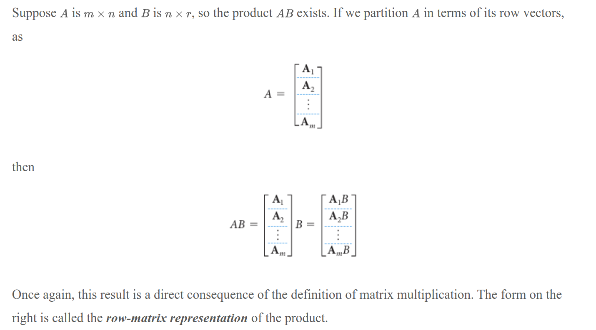

- [Equality](#equality)
- [Addition/Subtraction](#additionsubtraction)
  - [Properties](#properties)
- [Scalar Multiplication](#scalar-multiplication)
  - [Properties](#properties-1)
  - [Linear Combinations of Matrices](#linear-combinations-of-matrices)
- [Matrix Multiplication](#matrix-multiplication)
  - [Reproducing Columns/Rows](#reproducing-columnsrows)
- [Partitioning](#partitioning)
  - [Partition Multiplication](#partition-multiplication)
  - [Block Multiplication](#block-multiplication)
- [Transpose](#transpose)
- [Exponentiation](#exponentiation)
  - [Properties](#properties-2)


Since we can view matrices as generalizations of vectors (and, indeed, matrices can and should be thought of as being made up of both row and column vectors), many of the conventions and operations for vectors carry through (in an obvious way) to matrices. But there are also some new operations that are specific to matrices.


# Equality

Two matrices are equal if they have the same size and their corresponding elements are equal. 

# Addition/Subtraction

Generalizing from vector addition, we can define matrix addition as component-wise addition of each element of the two matrices.

Similarly, matrix subtraction is defined as component-wise subtraction of each element of the two matrices: $A - B = A + (-B)$ where $-B$ is the negative or negation of matrix $B$.

$A + B = \begin{bmatrix} A_{11} + B_{11} & A_{12} + B_{12} & \cdots & A_{1n} + B_{1n} \\ A_{21} + B_{21} & A_{22} + B_{22} & \cdots & A_{2n} + B_{2n} \\ \vdots & \vdots & \ddots & \vdots \\ A_{m1} + B_{m1} & A_{m2} + B_{m2} & \cdots & A_{mn} + B_{mn} \end{bmatrix}$

$A - B = \begin{bmatrix} A_{11} - B_{11} & A_{12} - B_{12} & \cdots & A_{1n} - B_{1n} \\ A_{21} - B_{21} & A_{22} - B_{22} & \cdots & A_{2n} - B_{2n} \\ \vdots & \vdots & \ddots & \vdots \\ A_{m1} - B_{m1} & A_{m2} - B_{m2} & \cdots & A_{mn} - B_{mn} \end{bmatrix}$


## Properties

- **Commutative**: $A + B = B + A$
- **Associative**: $(A + B) + C = A + (B + C)$
- **Additive Identity**: $A + 0_{m \times n} = A$
- **Additive Inverse**: $A + (-A) = 0_{m \times n}$

# Scalar Multiplication

Scalar multiplication of a matrix is defined as multiplying each element of the matrix by the scalar.

If $A$ is a matrix and $c$ is a scalar, then the **scalar multiple** of $A$ by $c$ is denoted by $cA$.

$c \cdot A = \begin{bmatrix} c \cdot A_{11} & c \cdot A_{12} & \cdots & c \cdot A_{1n} \\ c \cdot A_{21} & c \cdot A_{22} & \cdots & c \cdot A_{2n} \\ \vdots & \vdots & \ddots & \vdots \\ c \cdot A_{m1} & c \cdot A_{m2} & \cdots & c \cdot A_{mn} \end{bmatrix}$


## Properties

- **Distributive**: $c(A + B) = cA + cB$
- **Distributive**: $(c + d)A = cA + dA$
- **Associative**: $c(dA) = (cd)A$
- **Multiplicative Identity**: $1 \cdot A = A$

## Linear Combinations of Matrices

A linear combination of matrices is a sum of scalar multiples of matrices. For example, $cA + dB$ is a linear combination of matrices $A$ and $B$.


# Matrix Multiplication

The product of two matrices $A$ and $B$ is defined only if the number of columns in $A$ is equal to the number of rows in $B$. If $A$ is an $m \times n$ matrix and $B$ is an $n \times p$ matrix, then the product $AB$ is an $m \times p$ matrix.

If $A$ is an $m \times n$ matrix and $B$ is an $n \times p$ matrix, then the product $AB$ is defined as the $m \times p$ matrix $C$ where each element $C_{ij}$ is the dot product of the $i$th row of $A$ and the $j$th column of $B$.

> $C_{ij} = A_{i1}B_{1j} + A_{i2}B_{2j} + \cdots + A_{in}B_{nj}$


## Reproducing Columns/Rows

Multiplication of a matrix by a standard unit vector can "pick out" or "reproduce" a column or row of the matrix.

consider a 2x3 matrix $A = \begin{bmatrix} 1 & 2 & 3 \\ 4 & 5 & 6 \end{bmatrix}$

$\begin{bmatrix} 0 \\ 0 \\ 1 \end{bmatrix} \cdot A = \begin{bmatrix} 3 \\ 6 \end{bmatrix}$


# Partitioning

Matrices can be partitioned into submatrices. For example, a matrix $A$ can be partitioned into four submatrices $A_{11}$, $A_{12}$, $A_{21}$, and $A_{22}$.

> When matrices are being multiplied, there is often an advantage to be gained by viewing them as partitioned matrices. Not only does this frequently reveal underlying structures, but it often speeds up computation, especially when the matrices are large and have many blocks of zeros. It turns out that the multiplication of partitioned matrices is just like ordinary matrix multiplication.


Suppose $A$ is $m \times n$ and $B$ is $n \times r$. If we partition $B$ in terms of its column vectors, as $B = [b_1 \vdots b_2 \vdots \cdots \vdots b_r]$, then the product $AB$ can be written as $AB = [Ab_1 \vdots Ab_2 \vdots \cdots \vdots Ab_r]$.

```python
A: torch.Tensor = A[0:2, 0:2]
```


## Partition Multiplication




## Block Multiplication


# Transpose

The transpose of a matrix $A$ is denoted by $A^T$ and is obtained by swapping the rows and columns of $A$.

# Exponentiation

The exponentiation of a matrix $A$ is defined as the product of $n$ copies of $A$. For example, $A^2 = A \cdot A$ and $A^3 = A \cdot A \cdot A$.


## Properties

$(A^n)^m = A^{n \cdot m}$

$A^n \cdot A^m = A^{n + m}$