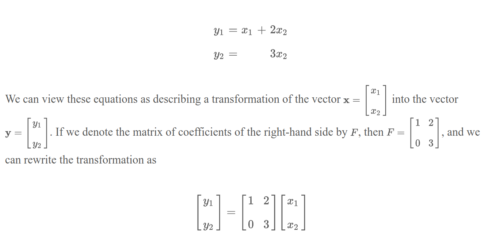

# Matrices from Equations

$Ax = b$ where $A$ is a matrix, $x$ is a column vector, and $b$ is a column vector.

$Ax = b$ has a solution iff $b$ is a linear combination of the columns of $A$.

# Notation

We use *double-subscript* notation to refer to elements of a matrix. For example, $A_{ij}$ refers to the element in the $i$th row and $j$th column of matrix $A$.

# Features

## Size

The size of a matrix is defined by the number of rows and columns it has. For example, a matrix with 3 rows and 2 columns is called a 3x2 matrix.

## Diagonal Entries

The diagonal entries of a matrix are the entries that lie on the diagonal from the top-left to the bottom-right of the matrix. For example, the diagonal entries of a 3x3 matrix are $A_{11}$, $A_{22}$, and $A_{33}$.

# Types

## Row Matrix

A row matrix is a matrix with only one row. It is also called a row vector.

## Column Matrix

A column matrix is a matrix with only one column. It is also called a column vector.

## Square Matrix

A square matrix is a matrix with the same number of rows and columns. For example, a 3x3 matrix is a square matrix.

## Identity Matrix

An identity matrix is a square matrix with 1s on the diagonal and 0s elsewhere, denote by $I_n$ or simply $I$ if the size is clear from the context.

## Negative Matrix

The negative of a matrix $A$ is denoted by $-A$ and is obtained by negating each element of $A$.

## Zero Matrix

A zero matrix is a matrix where all elements are zero. It is denoted by $0$ or $0_{m \times n}$ if the size is not clear from the context.
