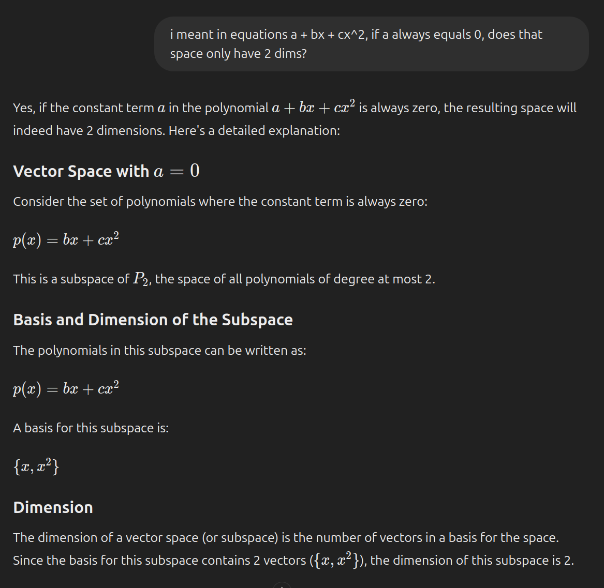
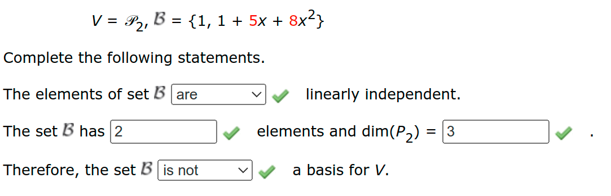

- [Polynomial Subspaces](#polynomial-subspaces)
  - [When One Coefficient is Zero](#when-one-coefficient-is-zero)
- [Matrix Subspaces](#matrix-subspaces)
  - [Determinant and Linear Independence](#determinant-and-linear-independence)
  - [Review and Summary](#review-and-summary)
- [Sets and Subspaces](#sets-and-subspaces)
    - [Linear Independence and Subspaces](#linear-independence-and-subspaces)
    - [Addressing Your Question](#addressing-your-question)
    - [Conclusion](#conclusion)

# Polynomial Subspaces

## When One Coefficient is Zero

For example, in $V = {p(x) | \mathbb{P}_2 | p(0) = 0}$.

- Let the general term for the polynomial be described as $p(x) = ax^2 + bx + c$
- Then $p(0) = c \implies$
- In all cases, $c$ must be zero $\implies$
- $p(x) = ax^2 + bx \implies$
- $V$ is a two-dimensional subspace of $\mathbb{P}_2$ (rather than three-dimensional)
- The subspace is spanned by $x^2$ and $x$
  - I.e., the basis for $V$ is $\{x^2, x\}$

# Matrix Subspaces

## Determinant and Linear Independence

1. Construct a matrix wherein the columns are the terms of each matrix in the set
2. Reduce the matrix
3. If the determinant is non-zero, the columns are linearly independent
4. If the determinant is zero, the columns are linearly dependent. To find the matrix that is a linear combination of the others, find the RREF of the matrix. The row that is all zeros is a linear combination of the other rows. The coefficients in that linear combination are given by the leading terms in the RREF formed by the other rows.

## Review and Summary

- **Determinant and Linear Independence**: The determinant of a matrix helps determine if its columns (or rows) are linearly independent. A non-zero determinant indicates linear independence, while a zero determinant indicates linear dependence.

- **RREF and Linear Combinations**: In the RREF of a matrix:
  - Rows of zeros indicate linear relationships among the columns (vectors).
  - The RREF provides a systematic way to identify which vector is a linear combination of others and the coefficients of this combination.

# Sets and Subspaces

### Linear Independence and Subspaces

1. **Definition of a Subspace**: A subspace of a vector space \( V \) is a subset of \( V \) that is closed under addition and scalar multiplication. This means if \( \mathbf{u}, \mathbf{v} \) are in the subspace and \( \alpha, \beta \) are scalars, then \( \alpha \mathbf{u} + \beta \mathbf{v} \) must also be in the subspace.

2. **Linear Independence**: In a vector space, a set of vectors \( \{\mathbf{v}_1, \mathbf{v}_2, \ldots, \mathbf{v}_n\} \) is linearly independent if the only solution to \( c_1 \mathbf{v}_1 + c_2 \mathbf{v}_2 + \ldots + c_n \mathbf{v}_n = \mathbf{0} \) is \( c_1 = c_2 = \ldots = c_n = 0 \). In other words, none of the vectors can be expressed as a linear combination of the others.

3. **Basis and Dimension**: A basis for a subspace is a set of linearly independent vectors that span the entire subspace. The number of vectors in a basis is called the dimension of the subspace.

### Addressing Your Question

- If you have a set \( B = \{\mathbf{v}_1, \mathbf{v}_2, \mathbf{v}_3, \mathbf{v}_4\} \) and one of these vectors (say \( \mathbf{v}_4 \)) is a linear combination of the others (say \( \mathbf{v}_4 = a \mathbf{v}_1 + b \mathbf{v}_2 + c \mathbf{v}_3 \)), then technically, \( \mathbf{v}_4 \) is not contributing to the linearly independent set of vectors that can form a basis for the subspace.

- **Subspace Definition**: According to the definition of a subspace, the presence of \( \mathbf{v}_4 \) in the set \( B \) does not add additional dimensionality or independence to the subspace beyond what is already spanned by \( \{\mathbf{v}_1, \mathbf{v}_2, \mathbf{v}_3\} \).
- **Removal from Set \( B \)**: In terms of forming a basis or understanding the dimensionality of the subspace, \( \mathbf{v}_4 \) would not be considered part of the basis because it is redundant due to being expressible as a linear combination of \( \{\mathbf{v}_1, \mathbf{v}_2, \mathbf{v}_3\} \). From a theoretical standpoint, when discussing subspaces, we focus on the minimal set of vectors that are linearly independent and span the subspace.

### Conclusion

If one vector in a set can be expressed as a linear combination of the others, it does not contribute to the dimensionality or the basis of the subspace beyond what is already spanned by the linearly independent vectors.
