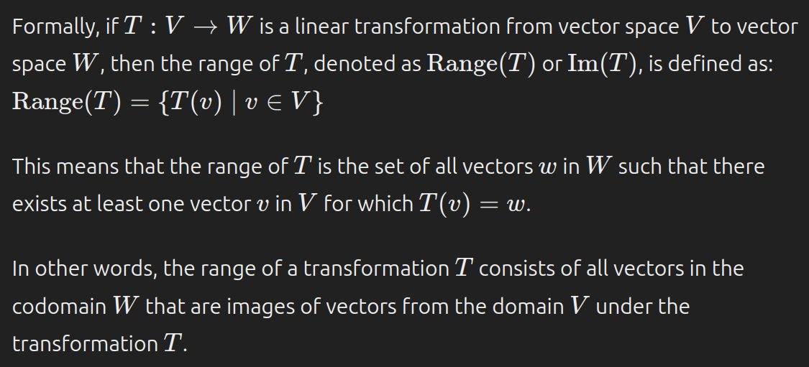

- [Properties of Transformations](#properties-of-transformations)
  - [Domain](#domain)
  - [Codomain](#codomain)
  - [Range](#range)
  - [Image](#image)
  - [Preimage](#preimage)
  - [Kernel](#kernel)
  - [Null Space](#null-space)
  - [Injective (1-1)](#injective-1-1)
  - [Surjective (Onto)](#surjective-onto)
  - [Invertibility](#invertibility)
    - [Properties of Invertible Transformations](#properties-of-invertible-transformations)
    - [Properties of Non-Invertible Transformations](#properties-of-non-invertible-transformations)
  - [Identity](#identity)
  - [Inverse](#inverse)
    - [Relationship with Row Operations](#relationship-with-row-operations)
    - [Algorithm for Finding the Inverse of a Matrix](#algorithm-for-finding-the-inverse-of-a-matrix)
  - [Determinant](#determinant)
  - [Rank](#rank)
  - [Nullity](#nullity)
  - [Compositions](#compositions)

> A transformation is determined by how it transforms the elements of a basis.

For transformation $T: V \rightarrow W$:

# Properties of Transformations

## Domain

The domain of a transformation is the set of all possible inputs to the transformation. It is denoted by $V$.

## Codomain

The codomain of a transformation is the set of all possible outputs of the transformation. It is denoted by $W$.

## Range

## Image

The image of a transformation is the set of all possible outputs of the transformation. It is denoted by $T(V)$.

## Preimage

The preimage of a transformation is the set of all inputs that map to a given output. It is denoted by $T^{-1}(w)$.

## Kernel

The kernel of a transformation is the set of all inputs that are mapped to the zero vector in the codomain. It is denoted by $ker(T)$.

## Null Space

The null space of a transformation is the set of all inputs that are mapped to the zero vector in the codomain. It is denoted by $N(T)$.

## Injective (1-1)

A transformation is injective if each element in the domain maps to a unique element in the codomain.

## Surjective (Onto)

A transformation is surjective if every element in the codomain is the image of at least one element in the domain.

## Invertibility

### Properties of Invertible Transformations

- Invertible
  - there is another transformation $T^{-1}: W \rightarrow V$ such that $T^{-1} \circ T = I_V$ and $T \circ T^{-1} = I_W$
  - there is another transformation $T^{-1}: W \rightarrow V$ such that $T^{-1}(T(u)) = u$ for all $u \in V$
- 1-1 (injective) and Onto (surjective)
  - *1-1*: for every $w \in W$, there is at most one $v \in V$ such that $T(v) = w$
  - *Onto*: for every $w \in W$, there is at least one $v \in V$ such that $T(v) = w$
- Square
  - $T$ maps n-dimensional space to n-dimensional space
  - If it is not square because the codomain is smaller, then it is not onto
  - If it is not square because the domain is smaller, then it is not 1-1
  - The matrix representation of a square transformation is a square matrix
- Maps a basis to a basis
  - $det(A) \neq 0$
  - The columns of the matrix representation are linearly independent
  - The transformation of a basis spans the codomain

### Properties of Non-Invertible Transformations

- Not invertible
- Either not 1-1 or not onto (making it not square)
  - *Not 1-1*: for every $w \in W$, there is more than one $v \in V$ such that $T(v) = w$
    - The codomain may have more dimensions than the domain
  - *Not onto*: for every $w \in W$, there is no $v \in V$ such that $T(v) = w$
    - The codomain may have fewer dimensions than the domain
- does not map a basis to a basis
  - The columns of the matrix representation are linearly dependent
  - $det(A) = 0$

## Identity

The identity matrix is a square matrix with 1s on the diagonal and 0s elsewhere. It is denoted by $I_n$ or simply $I$ if the size is clear from the context.

The identity matrix maps each standard basis vector to itself.

## Inverse

The inverse of a square matrix $A$ is denoted by $A^{-1}$ and is defined such that $A^{-1}A = I$ and $AA^{-1} = I$.

### Relationship with Row Operations

Multiplying ont he left by an elementary matrix $E$ is equivalent to applying the row operation represented by $E$ to the identity matrix.

For example, a vertical shear matrix $S$ can be constructed by multiplying the identity matrix by an elementary matrix $E$ that represents a vertical shear operation.

$E = \begin{bmatrix} 1 & 0 \\ 2 & 1 \end{bmatrix}$

$S = E \begin{bmatrix} 1 & 0 \\ 0 & 1 \end{bmatrix} = \begin{bmatrix} 1 & 0 \\ 2 & 1 \end{bmatrix}$

### Algorithm for Finding the Inverse of a Matrix

1. Augment the matrix with its identity matrix
2. Perform row operations to transform the left side into the identity matrix
3. The right side is the inverse of the original matrix

## Determinant

The determinant of a square matrix $A$ is denoted by $det(A)$ and is a scalar value that represents how the matrix scales the volume of a unit cube.

The determinant of a matrix is non-zero if and only if the matrix is invertible.

## Rank

The rank of a matrix is the maximum number of linearly independent rows or columns in the matrix. It is denoted by $rank(A)$.

## Nullity

The nullity of a matrix is the number of free variables in the solution to the homogeneous system $Ax = 0$. It is denoted by $nullity(A)$.

## Compositions

- The composition of invertible transformations is invertible
- The codomain of the first transformation must match the domain of the second transformation (in terms of dimensions)
  - Remember by pairing the closest dimensions when put side by side