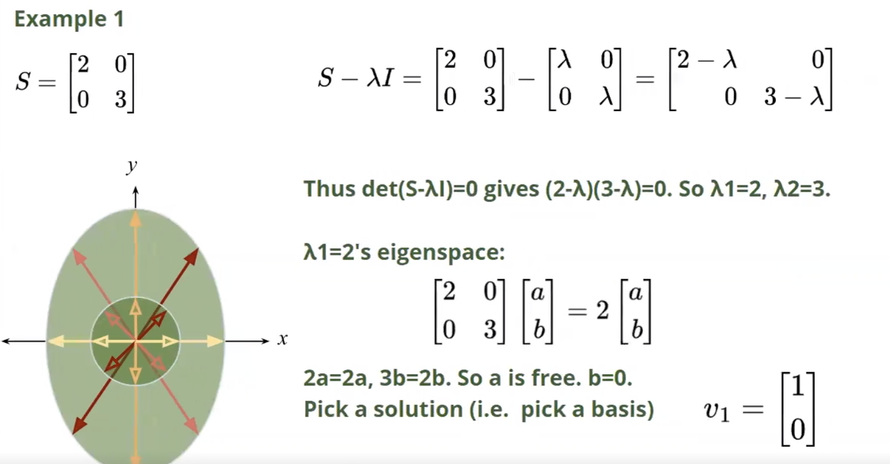
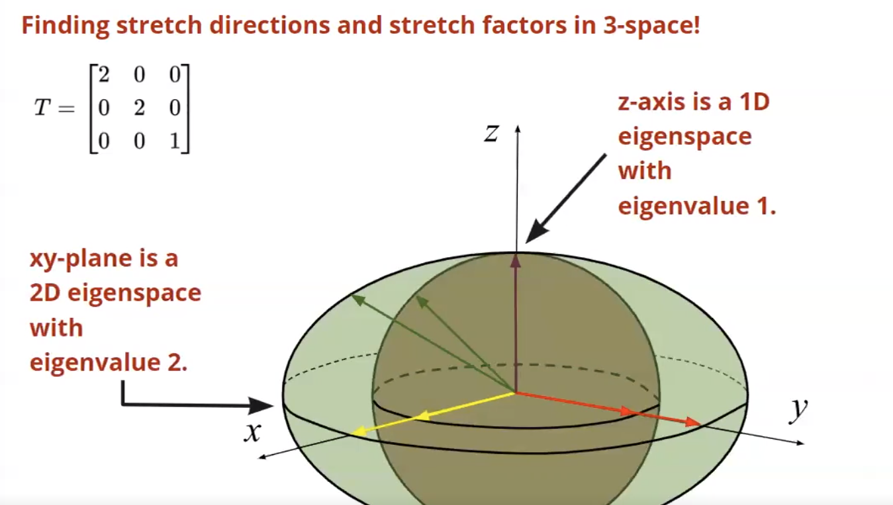

# Stretch Directions

**Stretch Directions** of a linear transformation $T$ are lines along which a linear transformation stretches/contract or reflects, but *DOES NOT* rotate.

To quantify the amount by which the linear transformation stretches or contracts in any stretch direction, we find a vector $v$ lying in the line and solve for $c$

$T(v) = cv$

The scalar $c$ is the stretch factor in the stretch-direction $v$.

The more stretch directions a linear transformation has, the less overall rotate. The fewer the stretch directions, the more overall rotation.

# Stretch Factor

The stretch factor of a linear transformation $T$ in a stretch direction $v$ is the scalar $c$ such that $T(v) = cv$.

The stretch factor is the ratio of the length of the image of a vector to the length of the original vector.

If $c > 1$, then the linear transformation stretches the vector in the stretch direction. If $0 < c < 1$, then the linear transformation contracts the vector in the stretch direction. If $c = 1$, then the linear transformation does not stretch or contract the vector in the stretch direction.

The stretch factor is always positive.

## Finding the Stretch Factor

To find the stretch factor of a linear transformation $T$ in a stretch direction $v$, we solve the equation $T(v) = cv$ for $c$.

$Tv - cv = 0$

$(T - cI)v = 0$

> **Note:** $v$ has to be non-zero. Thus this equation can only be true if $T - cI$ has a nontrivial kernal - is singular.

### The Eigenvalue-Eigenvector Equation

$c$ is an eigenvalue of the transformation $T$

$v$ is an eigenvector of the transformation $T$ corresponding to the eigenvalue $c$.

*Any scalar multiple of $v$ is also an eigenvector of $T$ corresponding to the eigenvalue $c$.*

Give a *basis* of vectors for the **eigenspace** of a particular eigenvalue $c$ of a linear transformation $T$.

> A linear transformation $T$ has an eigenvector $v$ corresponding to the eigenvalue $c$ if and only if the matrix of $T$ has a nontrivial kernal when $c$ is subtracted from the diagonal elements of the matrix.

> A linear transformation $T$ from n-space to n-space is not invertible if and only if 0 is an eigenvalue of $T$ (0 is a stretch factor of $T$ in some direction).

#### 3D Eigenspace

### The Characteristic Polynomial

$det(T - cI) = 0$

The roots of the characteristic polynomial are the eigenvalues of the transformation $T$.

## Finding the Stretch Directions

To find the stretch directions of a linear transformation $T$, we find the eigenvectors of the transformation.

The stretch directions are the eigenvectors of the transformation.

## Multiplicity of an Eigenvalue

The algebraic and geometric multiplicity of an eigenvalue describe different aspects of how that eigenvalue relates to a matrix:

### Algebraic Multiplicity (AM):

Definition: The number of times an eigenvalue appears as a root of the characteristic polynomial of a matrix.

Interpretation: The AM represents the multiplicity of the eigenvalue as a solution to the equation that determines the eigenvalues (the characteristic equation).

Example: If the characteristic polynomial of a matrix factors as (λ - 2)^3(λ + 1), then the eigenvalue 2 has an algebraic multiplicity of 3.

### Geometric Multiplicity (GM):

Definition: The dimension of the eigenspace associated with an eigenvalue. The eigenspace is the set of all eigenvectors corresponding to that eigenvalue, along with the zero vector.

Interpretation: The GM indicates how many linearly independent eigenvectors exist for a given eigenvalue. It essentially reflects the amount of "freedom" or "variety" in the directions associated with that eigenvalue.

Example: If the eigenspace corresponding to the eigenvalue 2 has a basis of two vectors, then the geometric multiplicity of 2 is 2.

### Key Relationship and Implications:

GM ≤ AM: The geometric multiplicity of an eigenvalue is always less than or equal to its algebraic multiplicity.

Defective Eigenvalues: An eigenvalue is called "defective" if its geometric multiplicity is strictly less than its algebraic multiplicity. This means there aren't enough linearly independent eigenvectors to "fill up" the space implied by the algebraic multiplicity.

Diagonalizability: A matrix is diagonalizable if and only if the geometric multiplicity equals the algebraic multiplicity for all eigenvalues. This means we have enough linearly independent eigenvectors to form a basis for the entire vector space.
Illustrative Example:

Consider the matrix:

A = | 2  1 |
    | 0  2 |

Characteristic Polynomial: (λ - 2)^2

Eigenvalue: λ = 2 (AM = 2)

Eigenspace: span{(1, 0)} (GM = 1)

Interpretation: The eigenvalue 2 appears twice as a root of the characteristic polynomial, but there's only one linearly independent eigenvector associated with it. This makes the eigenvalue 2 defective, and the matrix A is not diagonalizable.

Let me know if you'd like more examples or clarification on any of these concepts!