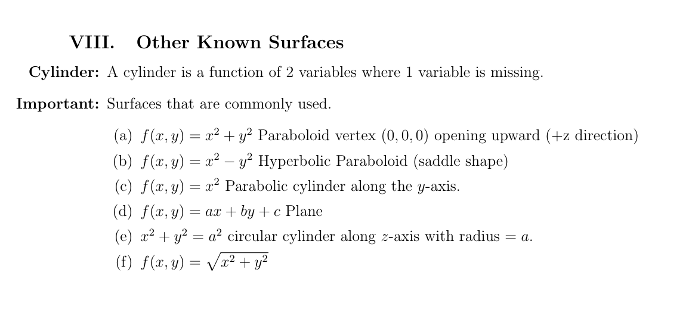
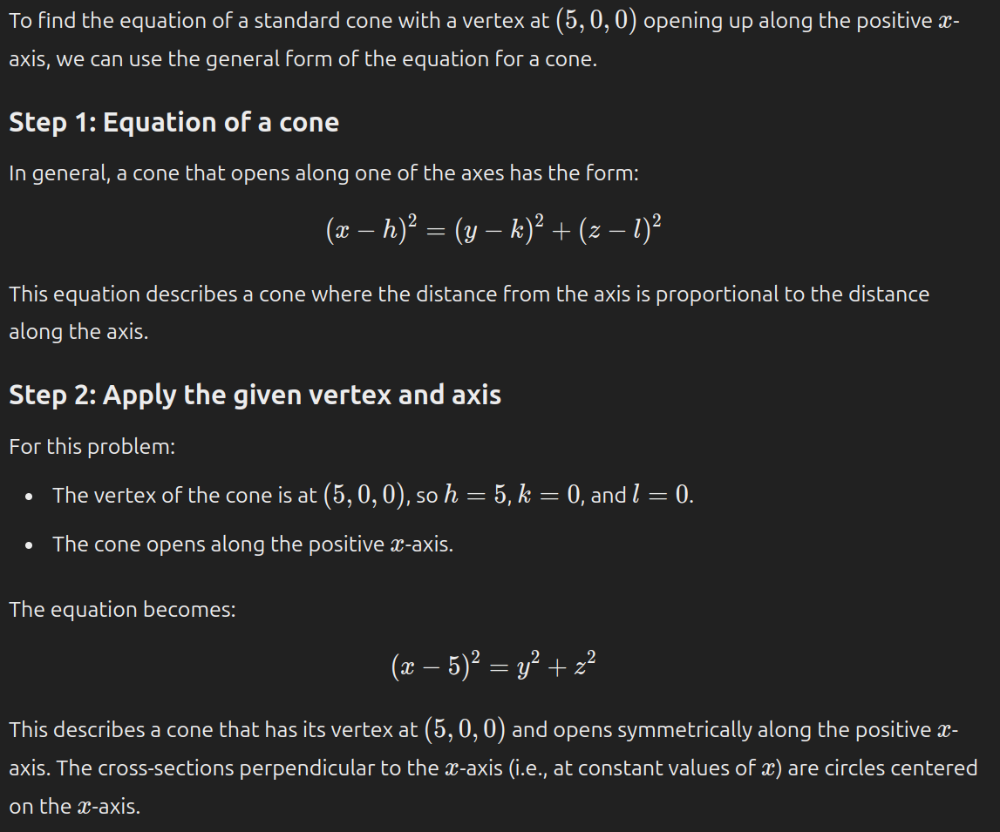
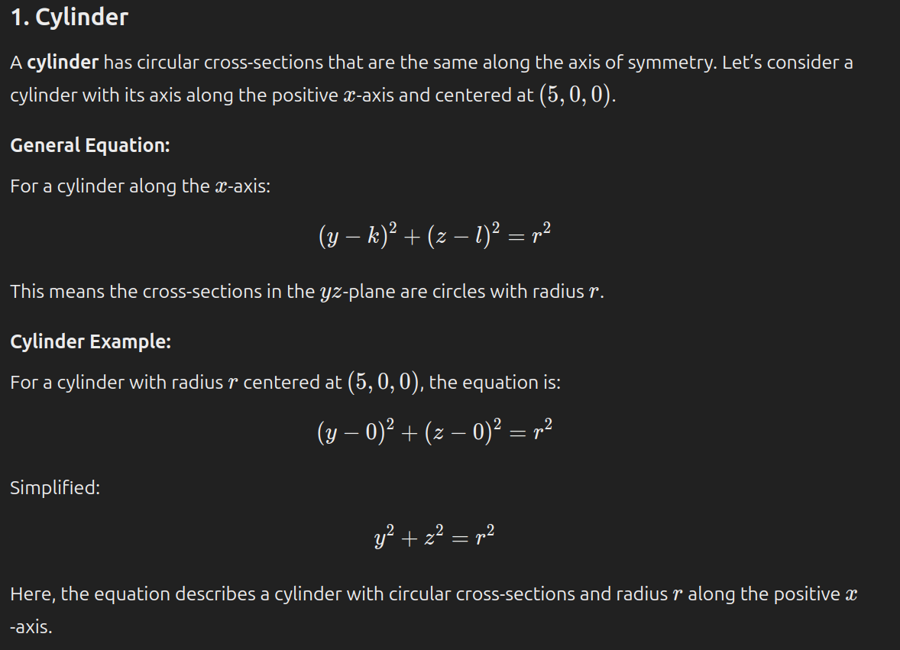
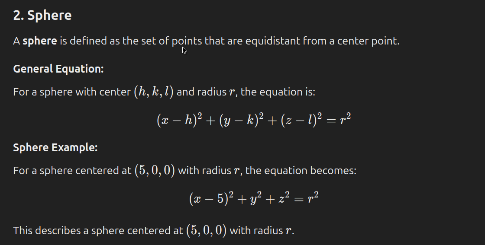
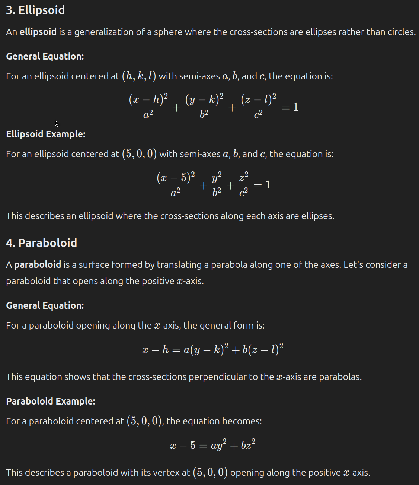
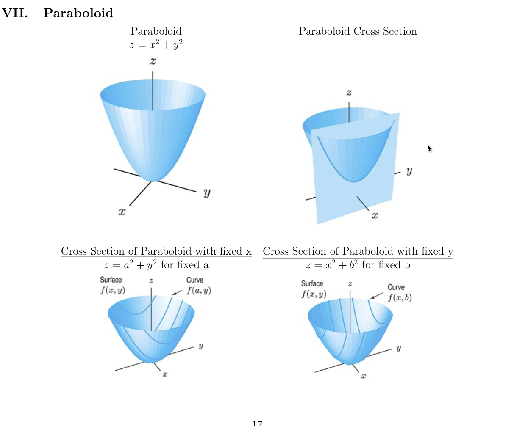
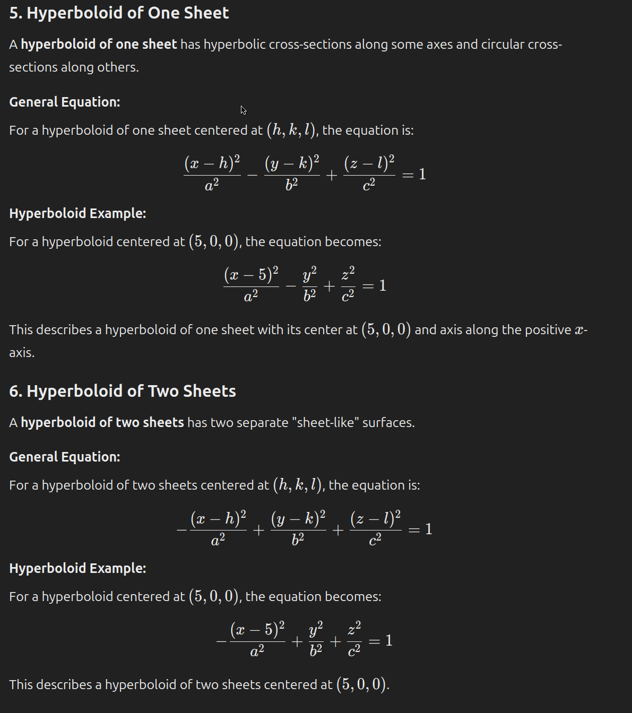
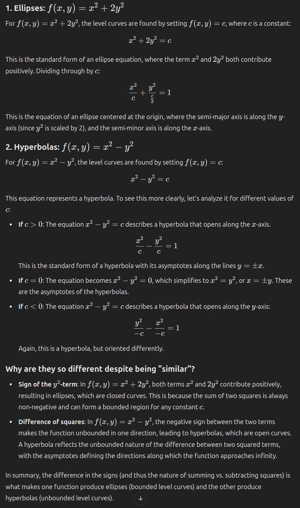

# Equations of Lines and Planes

## Equation of Planes from Points and Normal Vectors

> Find the equation of the vertical plane perpendicular to the x-axis and through the point (1, -8, 4).

A vertical plane perpendicular to the x-axis is parallel to the yz-plane. Thus, the normal vector to the plane is $\mathbf{i}$.

The equation of the plane is:

$$
\mathbf{n} \cdot (\mathbf{r} - \mathbf{r}_0) = 0
$$

Where:

- $\mathbf{n}$ is the normal vector to the plane.
- $\mathbf{r}$ is the position vector of a point on the plane.
- $\mathbf{r}_0$ is the position vector of a point on the plane.
- $\cdot$ is the dot product.
- $0$ is the constant.

Given that the normal vector is $\mathbf{i}$ and the point is (1, -8, 4), the equation of the plane is:

$$
\mathbf{i} \cdot (\begin{bmatrix} x \\ y \\ z \end{bmatrix} - \begin{bmatrix} 1 \\ -8 \\ 4 \end{bmatrix}) = 0
$$

Solving this equation gives the equation of the plane.

**Explanation why the normal vector is $\mathbf{i}$**:

The equation $x = c$ describes a vertical plane that is perpendicular to the x-axis.

- A plane of the form $x = c$ means that for every point on the plane, the x-coordinate is always $c$. I.e., the plane is a set of all points $(c, y, z)$.
- This plane is **perpendicular** to the x-axis because the x-coordinate is constant for all points on the plane.
- Thus, in this case, the equation $x = 1$ describes a vertical plane that is perpendicular to the x-axis which contains the point (1, -8, 4).

## Finding the Center

> A cube is located such that its top four corners have the coordinates (-2, 4, 5), (-2, 8, 5), (2, 4, 5), and (2, 8, 5). Give the coordinates of the center of the cube. Enter your coordinates separated by commas.

We are looking at the top face of the cube, which is a square. The center of the square is the average of the coordinates of the four corners.

Thus, we know the center at least has the shape: $(0, 6, z)$.

We can infer the z-coordinate by knowing that each side of the cube is equidistant (4 units long). Thus, the z-coordinate of the center is 5 - 2 = 3.

Center: $(0, 6, 3)$

## Determining 

> If something is constant along one x-axis, it can be thought of as extending along that axis infinitely. For example, $z = x^2 + y^2$ is a paraboloid that extends infinitely along the z-axis. The particular shape can be discovered by considering how each variable varies with the constant variable. For example, if $z = x^2 + y^2$, then $z$ increases as $x$ and $y$ increase, creating a paraboloid.
> 
> 
> 

Consider the shapes of the shears

For example, with $z = -\sqrt{-x^2 - y^2}$:

- The shear of the $xz$-plane is a parabola that opens downward and is then reflected over the $x$-axis.
- The shear of the $yz$-plane is a parabola that opens downward and is then reflected over the $y$-axis.
- Together, the shears form a bowl shape that opens upward.

## Intersections

- To find the intersection with a $xy$-plane, set $z = 0$ and solve for $x$ and $y$.
- To find the intersection with the $x$-axis, set $y = 0$ and $z = 0$ and solve for $x$.
  - Remember to include $\pm$ for the square root.

## Finding Equation from Shape

> Find the equation of the surface.
> 
> A standard cone with vertex at (5, 0 , 0) opening up on the positive x-axis.

### Cone

### Cylinder

### Sphere

### Ellipsoid and Paraboloid

### Hyperboloid

# Level Curves

## Ellipses vs. Hyperbolas

