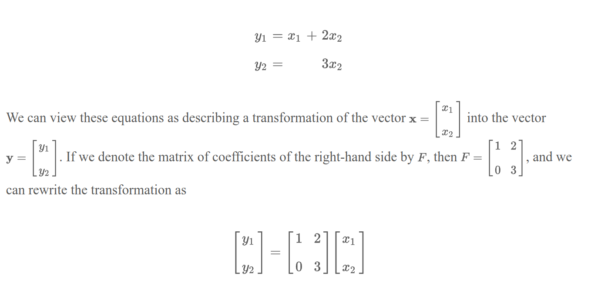

- [Matrices from Equations](#matrices-from-equations)
  - [Outer Product Expansion](#outer-product-expansion)
- [Notation](#notation)
- [Features](#features)
  - [Size](#size)
  - [Diagonal Entries](#diagonal-entries)
- [Types](#types)
  - [Row Matrix](#row-matrix)
  - [Column Matrix](#column-matrix)
  - [Square Matrix](#square-matrix)
  - [Identity Matrix](#identity-matrix)
  - [Negative Matrix](#negative-matrix)
  - [Zero Matrix](#zero-matrix)
- [Rank](#rank)
- [Symmetry](#symmetry)
- [Span and Linear Independence](#span-and-linear-independence)

# Matrices from Equations

$Ax = b$ where $A$ is a matrix, $x$ is a column vector, and $b$ is a column vector.

$Ax = b$ has a solution iff $b$ is a linear combination of the columns of $A$.

## Outer Product Expansion

The outer product expansion of a matrix is a way to represent a matrix as a sum of outer products of its columns.

# Notation

We use *double-subscript* notation to refer to elements of a matrix. For example, $A_{ij}$ refers to the element in the $i$th row and $j$th column of matrix $A$.

# Features

## Size

The size of a matrix is defined by the number of rows and columns it has. For example, a matrix with 3 rows and 2 columns is called a 3x2 matrix.

## Diagonal Entries

The diagonal entries of a matrix are the entries that lie on the diagonal from the top-left to the bottom-right of the matrix. For example, the diagonal entries of a 3x3 matrix are $A_{11}$, $A_{22}$, and $A_{33}$.

# Types

## Row Matrix

A row matrix is a matrix with only one row. It is also called a row vector.

## Column Matrix

A column matrix is a matrix with only one column. It is also called a column vector.

## Square Matrix

A square matrix is a matrix with the same number of rows and columns. For example, a 3x3 matrix is a square matrix.

## Identity Matrix

An identity matrix is a square matrix with 1s on the diagonal and 0s elsewhere, denote by $I_n$ or simply $I$ if the size is clear from the context.

## Negative Matrix

The negative of a matrix $A$ is denoted by $-A$ and is obtained by negating each element of $A$.

## Zero Matrix

A zero matrix is a matrix where all elements are zero. It is denoted by $0$ or $0_{m \times n}$ if the size is not clear from the context.

# Rank

The rank of a matrix is the maximum number of linearly independent rows or columns in the matrix. It is denoted by $rank(A)$.

# Symmetry

A matrix is symmetric if it is equal to its transpose. For example, a 3x3 symmetric matrix $A$ has the property

$A = A^T$

# Span and Linear Independence

A span of matrices is the set of all possible linear combinations of the matrices. For example, the span of two matrices $A$ and $B$ is the set of all matrices of the form $cA + dB$ where $c$ and $d$ are scalars.

Matrices are linearly independent if no matrix in the set can be expressed as a linear combination of the others. For example, two matrices $A$ and $B$ are linearly independent if $cA + dB = 0$ implies $c = d = 0$.