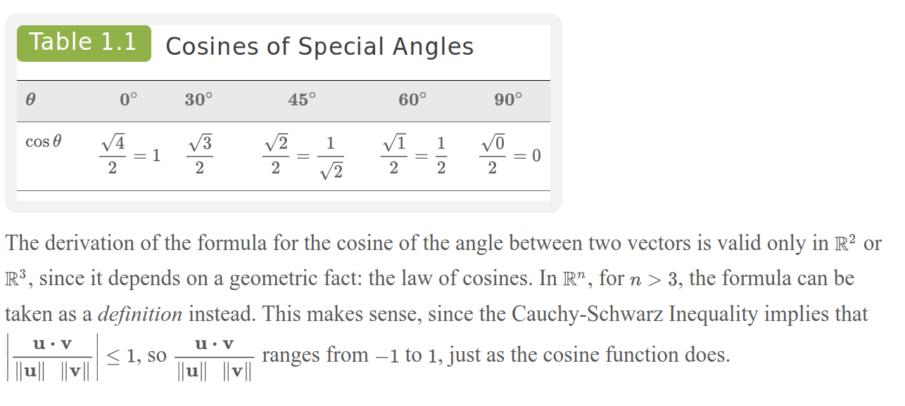

# Terminology

- The distance between two vectors is the direct analogue to the distance between two points in space.
- In terms of vectors, the distance between two vectors $u$ and $v$ is the length of the vector that connects the two vectors, $u - v$.
- The **distance** $d(u, v)$ between two vectors $u$ and $v$ is defined as $d(u, v) = \|u - v\|$.
  - This is the length of the vector connecting the two points.

## Example

# With Angles

- The dot product can also be used to calculate the angle between two vectors.
- In $R^2$ or $R^3$, the angle between two vectors $u$ and $v$ is given by the formula:
  - $\cos(\theta) = \frac{u \cdot v}{\|u\| \|v\|}$
  - I.e., the angle between the nonzero vectors $u$ and $v$ will refer to the angle $\theta$ such that $0 \leq \theta \leq \pi$ or $0 \leq \theta \leq 180^\circ$.

## Law of Cosines (Review)

- The law of cosines states that for any triangle with sides of length $a$, $b$, and $c$, and angle $\theta$ opposite side $c$, the following holds:
  - $c^2 = a^2 + b^2 - 2ab\cos(\theta)$
  - This can be rearranged to solve for $\cos(\theta)$:
    - $\cos(\theta) = \frac{a^2 + b^2 - c^2}{2ab}$
- This formula can be used to calculate the angle between two vectors in $R^2$ or $R^3$.
- The angle between two vectors is the angle between the two vectors when they are placed tail-to-tail.

### Special Angles 

