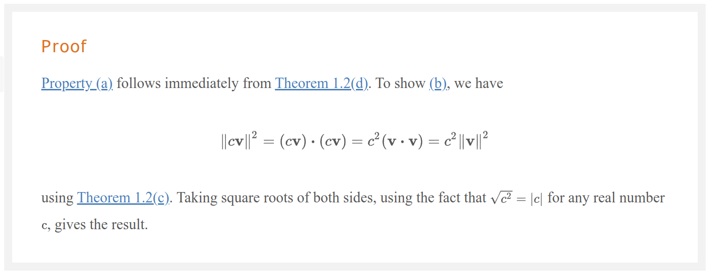
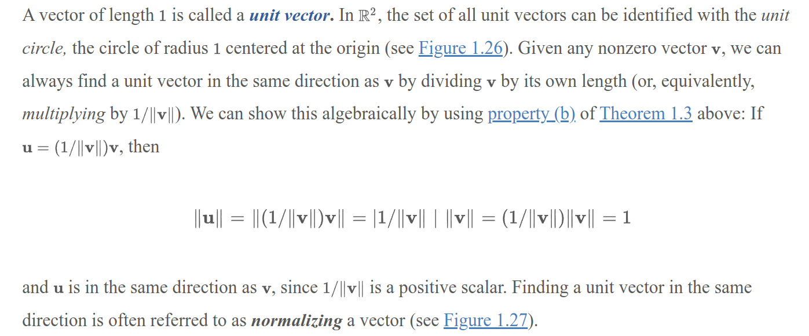

# Overview

# Terminology

- In $R^2$, the length of a vector is the distance from the origin to the point $(x, y)$ which by Pythagorean theorem is $\sqrt{x^2 + y^2}$.
- **Length** (or **norm**): The length of a vector $v$ is denoted by $\|v\|$ and is defined as $\|v\| = \sqrt{v \cdot v} = \sqrt{v_1^2 + v_2^2 + \ldots + v_n^2}$.
  - In words, the length of a vector is the square root of the sum of the squares of its components. 
  - Can be rewritten to show: $\|v\|^2 = v \cdot v = v_1^2 + v_2^2 + \ldots + v_n^2$.

# Properties

- **Non-negativity**: $\|v\| \geq 0$ and $\|v\| = 0$ if and only if $v = 0$.
- **Homogeneity**: $\|\alpha v\| = |\alpha| \|v\|$ for any scalar $\alpha$.
  - 

# Unit Vectors

- A **unit vector** is a vector of length 1.
- In $R^2$, the unit vector in the direction of a vector $v$ is $\frac{v}{\|v\|}$.
  - This can be identified using *unit circle*.
  - 
  - $u$ is in the same direction as $v$ since $\frac{1}/{\|v\|}$ is a positive scalar. But the length of $u$ is 1.
- In general, in $R^n$, we define unit vectors $e_1, e_2, \ldots, e_n$ as follows:
  - $e_1 = [1, 0, 0, \ldots, 0]$
  - $e_2 = [0, 1, 0, \ldots, 0]$
  - $\ldots$
  - $e_n = [0, 0, 0, \ldots, 1]$
- These vectors are called the **standard unit vectors** in $R^n$.
- They form a basis for $R^n$.

# The Triangle Inequality

- The **triangle inequality** states that for any vectors $u$ and $v$, $\|u + v\| \leq \|u\| + \|v\|$.

# Comparison with Normalizing to a Range

In the context of linear algebra, normalizing a vector typically means scaling it to have a unit norm (length of 1). This is different from scaling data to a specific range like [0, 1]. Here’s a breakdown of the two processes:

## Normalizing to [0, 1] Range

- Purpose: To scale data within a specific range, typically used for preparing input data for machine learning models.
- Method: Divide each element by the maximum value (or apply (x - min) / (max - min) if you want to scale from a general range to [0, 1]).
- Application: Used to ensure uniformity in data input, useful for neural networks or other algorithms sensitive to data range.
Example:

```python
Copy code
import torch

tensor = torch.tensor([1.0, 2.0, 3.0, 4.0, 5.0])
normalized_tensor = tensor / tensor.max()
>>> tensor([0.2000, 0.4000, 0.6000, 0.8000, 1.0000])
```

## Normalizing a Vector in Linear Algebra

- Normalizing a Vector in Linear Algebra
- Purpose: To scale the vector to have a unit norm (length of 1), used in various mathematical and physical contexts, like ensuring direction without magnitude.
- Method: Divide each element by the vector's norm (often the Euclidean norm, or L2 norm).
- Application: Used to get direction vectors, in optimization problems, and in many machine learning algorithms that require vectors of unit length.

```python 
import torch

vector = torch.tensor([1.0, 2.0, 3.0, 4.0, 5.0])
norm = vector.norm()  # Calculate the L2 norm
normalized_vector = vector / norm

print(normalized_vector)
>>> tensor([0.1348, 0.2697, 0.4045, 0.5394, 0.6742])
```

## Key Differences

- Range Normalization: Scales data to a specific range (e.g., [0, 1]). It adjusts the distribution of the data but doesn’t necessarily change its direction or unit properties.
- Vector Normalization: Scales a vector to have a unit length. It preserves the direction of the vector but standardizes its magnitude to 1.

## Practical Implications

- Range Normalization: Essential for data preprocessing, especially when different features have different units or scales. It ensures that each feature contributes proportionally to the model training.
- Vector Normalization: Important in algorithms that rely on the direction of vectors rather than their magnitude, such as in cosine similarity, certain optimization problems, and normalization layers in neural networks.