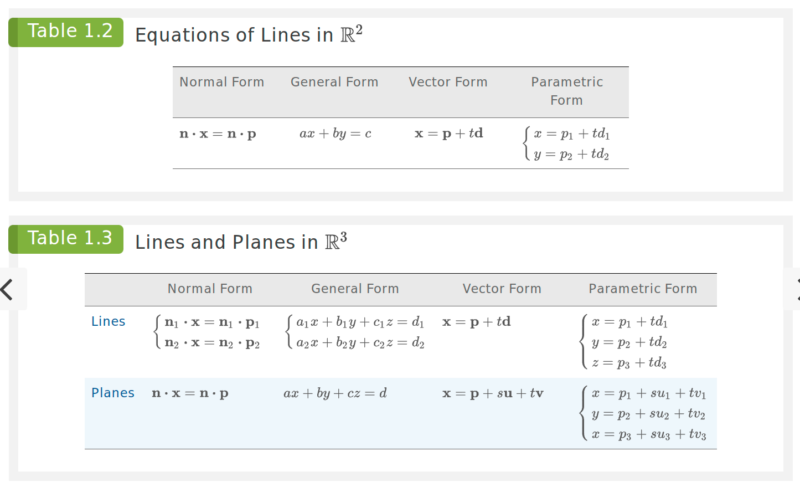
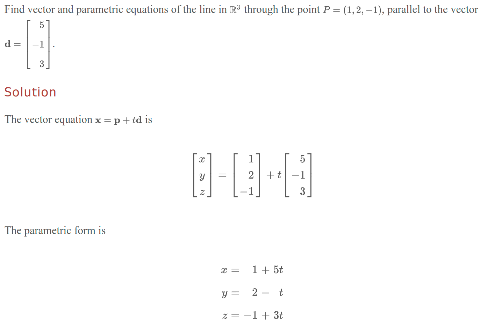
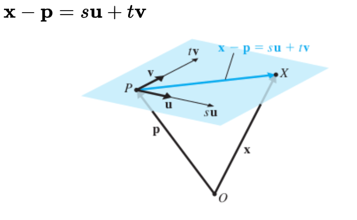

- [Lines in $R^2$](#lines-in-r2)
  - [Normal Form of a Line](#normal-form-of-a-line)
  - [Direction Vectors](#direction-vectors)
    - [Direction Vector vs. Unit Vector](#direction-vector-vs-unit-vector)
- [Generalization to Lines $R^n$](#generalization-to-lines-rn)
  - [Parametric Form of the Equation of a Line](#parametric-form-of-the-equation-of-a-line)
    - [Finding Parametric from Two Points](#finding-parametric-from-two-points)
- [Infinitely Many Lines](#infinitely-many-lines)
- [Planes in $R^3$](#planes-in-r3)
  - [Parametric Form of the Equation of a Plane](#parametric-form-of-the-equation-of-a-plane)
  - [Vector Form of the Equation of a Plane](#vector-form-of-the-equation-of-a-plane)
- [Hyperplanes](#hyperplanes)
- [Balancing Formula](#balancing-formula)

# Lines in $R^2$

## Normal Form of a Line

> $n \cdot (x - p) = 0$
>
> $n \cdot x = n \cdot p$

- Consider the line $l$ with equation $2x + y = 0$
- The left-hand side of the equation can be seen as a dot product
  - I.e., $2x + y = [2, 1] \cdot [x, y]$
  - Then the equation becomes $n \cdot x = 0$, where $n = [2, 1]$
- The vector $n$ is perpendicular to the line $l$ (since it describes a vector that goes from a point to 2 units to the right and 1 unit up - i.e., perpindicular to the slope of the line)
  - In fact, it should be *orthogonal* to any vector that is parallel to the line $l$
    - I.e., it is orthogonal to any direction vector of the line $l$
  - Thus, if you take any point on the line $l$, $x$, and another point $p$, then the vector $\overrightarrow{px}$ is parallel to the line $l$ and equal to $x - p$
  - Thus, $n \cdot (x - p) = 0$
- This vector $n$ is called the *normal vector* to the line $l$
- The equation $n \cdot x = 0$ is called the *normal form* of the equation of the line $l$
- If $x = t$ and $y = 2t$ for some scalar $t$, then the line $l$ is given by the parametric form $l = [t, 2t]$
  - Can be simplified to $l = t[1, 2]$ or $[x, y] = t[1, 2]$

## Direction Vectors

- A ***direction vector*** of a line is a vector that is parallel to the line, used to indicate the direction of the line
- It is not required to have any specific magnitude (legnth).
- For example, if you have a line in 3-space defined by the points $[1, 2, 3]$ and $[4, 5, 6]$, then the direction vector of the line is $[3, 3, 3]$
  - I.e., if the points are $(x_1, y_1, z_1)$ and $(x_2, y_2, z_2)$, then the direction vector is $[x_2 - x_1, y_2 - y_1, z_2 - z_1]$
- Any other line that is parallel to the original line will have the same direction vector
  - I.e., it will be a scalar multiple of the original direction vector

### Direction Vector vs. Unit Vector

- A ***unit vector*** is a vector that has a magnitude of 1
- Because it points in the same direction as the original vector, it is a type of direction vector
- But it is a special type of direction vector that has a magnitude of 1
- To obtain a unit vector from a direction vector, you can divide the direction vector by its magnitude
  - $u = \frac{d}{||d||}$

# Generalization to Lines $R^n$

## Parametric Form of the Equation of a Line

- The notion of a slope of a line in $R^2$ is difficult to generalize to higher dimensions; instead it is replaced by the notion of a direction vector, leading to the ***vector for of the equation of a line $l$***:
  - $x = p + td$
    - Where $p$ is a point on the line, $d$ is a direction vector of the line, and $t$ is a scalar
    - This equation is called the ***parametric form of the equation of a line***
- 

### Finding Parametric from Two Points

- Take two points, $(-1, 5, 0)$ and $(2, 1, 1)$
- The direction vector of the line is $[2 - (-1), 1 - 5, 1 - 0] = [3, -4, 1]$
- The initial point of the line is $(-1, 5, 0)$
- Thus, the parametric form of the equation of the line is $x = [-1, 5, 0] + t[3, -4, 1]$

# Infinitely Many Lines

- The vector and parametric forms of the equation of a given line $l$ are not unique
- There are infinitely many, since we may use any point on $l$ to determine $p$ and any direction vector for $l$
- However, all direction vectors are scalar multiples of each other, so they all point in the same direction

# Planes in $R^3$

- Every plane $P$ in $R^3$ can be described by a point $p$ on the plane and a nonzero normal vector $n$ to the plane
- Thus, if $x$ represents an arbitrary point on $P$, we have $n \cdot (x - p) = 0$ or $n \cdot x = n \cdot p$
  - E.g., if $n = [a, b, c]$ and $x = [x, y, z]$, then in terms of components, the equation becomes $ax +by + cz = d$ (where $d = n \cdot p$)
- This is called the ***normal form of the equation of a plane***
- The ***general form of the equation of a plane*** is $ax + by + cz = d$, where $n = [a, b, c]$ is a normal vector to the plane and $d = n \cdot p$ for some point $p$ on the plane

## Parametric Form of the Equation of a Plane

- We can observe that a plane can also be determined by specifying one of its points $P$ (by the vector $p$) and *two* direction vectors $u$ and $v$ parallel to the plane (but not parallel to each other)
- Given any point $X$ in the plance (located by $x$), we can always find approrpiate multiple $su$ and $tv$ of $u$ and $v$ such that $x = p + su + tv$ or $x - p$ (the vector from $p$ to $x$) is a linear combination of $u$ and $v$
  - I.e., $x - p = su + tv$
  - 

## Vector Form of the Equation of a Plane

> $x = p + su + tv$
>
> where $p$ is a point on the plane $P$, $u$ and $v$ are direction vectors of the plane, and $s$ and $t$ are scalars
> 
> 
> 

# Hyperplanes

- A single (general) equation describes a line when in $R^2$ and a plane in $R^3$
- In higher dimensions, a single equation describes a ***hyperplane***

# Balancing Formula

The relationship among the dimension of the object, the number of equations required, and the dimension of the space is given by the "balancing formula"

> (dimension of object) + (number of general equations) = (dimension of space)