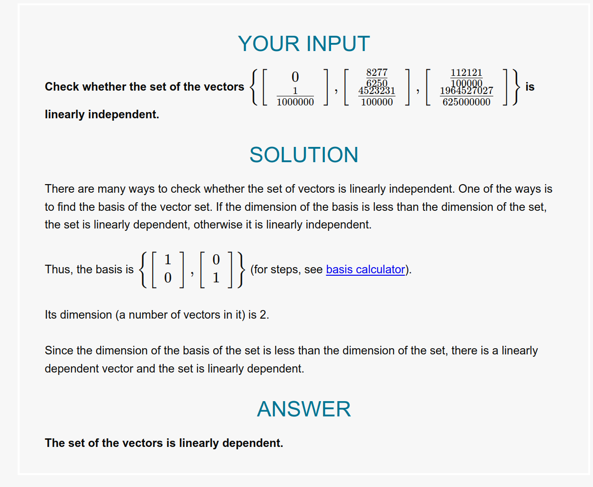

# Definition

***Linear independent***: Only solution is all scalars are zero.

***Linear dependent***: Non-trivial solution exists.

>  
> A set of vectors $\{\overline{v_1}, \overline{v_2}, \ldots, \overline{v_n}\}$ is said to be ***linearly independent*** if the only solution to the equation $c_1\overline{v_1} + c_2\overline{v_2} + \ldots + c_n\overline{v_n} = \overline{0}$ is $c_1 = c_2 = \ldots = c_n = 0$.
>
> A set of vectors that is ***linearly dependent*** is one where there exists a non-trivial solution to the equation $c_1\overline{v_1} + c_2\overline{v_2} + \ldots + c_n\overline{v_n} = \overline{0}$ (involving at least one $c_i \neq 0$).

# Methods for Determining Linear Independence

$\overline{v_1} = \begin{bmatrix} 1 \\ 0 \\ 0 \end{bmatrix}$, $\overline{v_2} = \begin{bmatrix} 0 \\ 1 \\ 0 \end{bmatrix}$, $\overline{v_3} = \begin{bmatrix} 0 \\ 0 \\ 1 \end{bmatrix}$

$\begin{bmatrix} 1 & 0 & 0 \\ 0 & 1 & 0 \\ 0 & 0 & 1 \end{bmatrix} \begin{bmatrix} c_1 \\ c_2 \\ c_3 \end{bmatrix} = \begin{bmatrix} 0 \\ 0 \\ 0 \end{bmatrix}$

## Method 1: Solving System of Equations

1. Rewrite the vectors into a system of equations and set them equal to the zero vector:

    $c_1\begin{bmatrix} 1 \\ 0 \\ 0 \end{bmatrix} + c_2\begin{bmatrix} 0 \\ 1 \\ 0 \end{bmatrix} + c_3\begin{bmatrix} 0 \\ 0 \\ 1 \end{bmatrix} = \begin{bmatrix} 0 \\ 0 \\ 0 \end{bmatrix}$

    $c_1 + 0 + 0 = 0$

    $0 + c_2 + 0 = 0$
    
    $0 + 0 + c_3 = 0$

2. Solve the system of equations
3. The only solution is $c_1 = c_2 = c_3 = 0$.

## Method 2: Row Echelon Form (Gaussian Elimination)

1. Write the vectors as rows in a matrix:

    $\begin{bmatrix} 1 & 0 & 0 \\ 0 & 1 & 0 \\ 0 & 0 & 1 \end{bmatrix}$

2. Perform row operations to reduce the matrix to row echelon form:
  
      $\begin{bmatrix} 1 & 0 & 0 \\ 0 & 1 & 0 \\ 0 & 0 & 1 \end{bmatrix} \rightarrow \begin{bmatrix} 1 & 0 & 0 \\ 0 & 1 & 0 \\ 0 & 0 & 1 \end{bmatrix}$

3. The matrix is in row echelon form, and the only solution is $c_1 = c_2 = c_3 = 0$.

## Method 3: Determinant

1. Write the vectors as columns in a matrix:

    $\begin{bmatrix} 1 & 0 & 0 \\ 0 & 1 & 0 \\ 0 & 0 & 1 \end{bmatrix}$

2. Calculate the determinant of the matrix:
3. The determinant is non-zero, so the only solution is $c_1 = c_2 = c_3 = 0$.

## Method 4: Rank

1. Write the vectors as columns in a matrix:

    $\begin{bmatrix} 1 & 0 & 0 \\ 0 & 1 & 0 \\ 0 & 0 & 1 \end{bmatrix}$

2. Calculate the rank of the matrix:

    $rank(\begin{bmatrix} 1 & 0 & 0 \\ 0 & 1 & 0 \\ 0 & 0 & 1 \end{bmatrix}) = 3$

3. Compare the rank to the number of vectors
    - If the rank is less than the number of vectors, then the vectors are linearly dependent.
    - If the rank is equal to the number of vectors, then the vectors are linearly independent.
    - If the rank is greater than the number of vectors, then the vectors span a subspace of the vector space.
7. The rank is equal to the number of vectors, so the only solution is $c_1 = c_2 = c_3 = 0$.